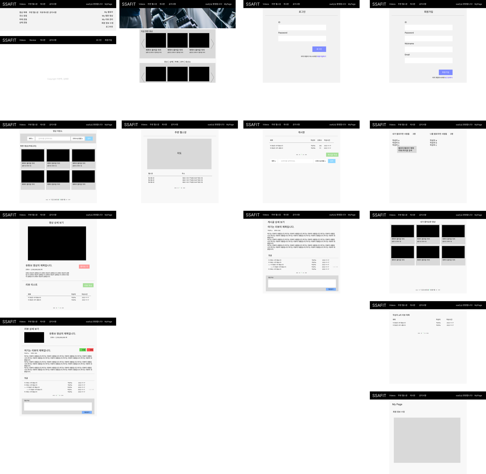
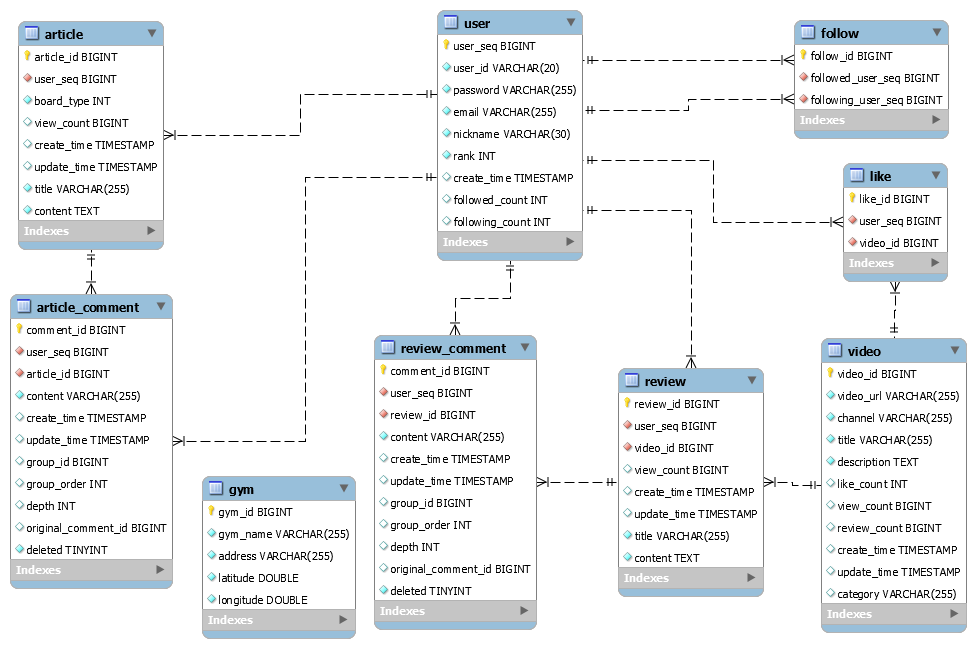
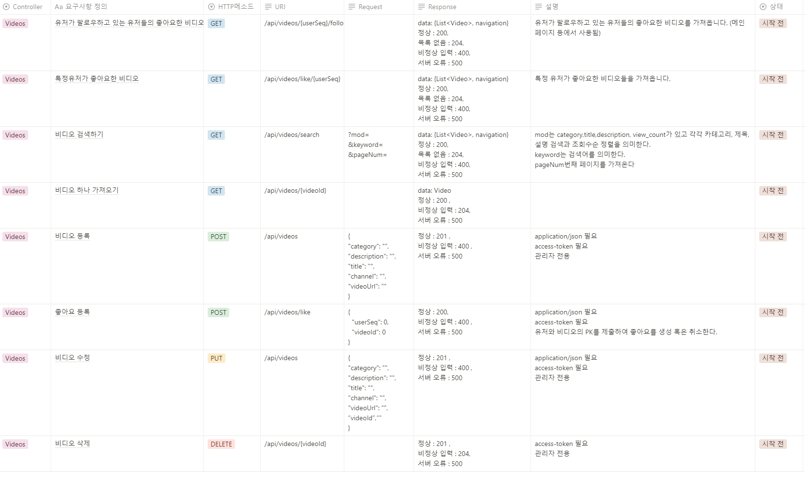
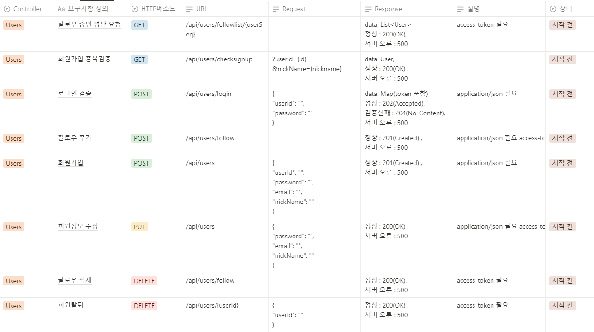
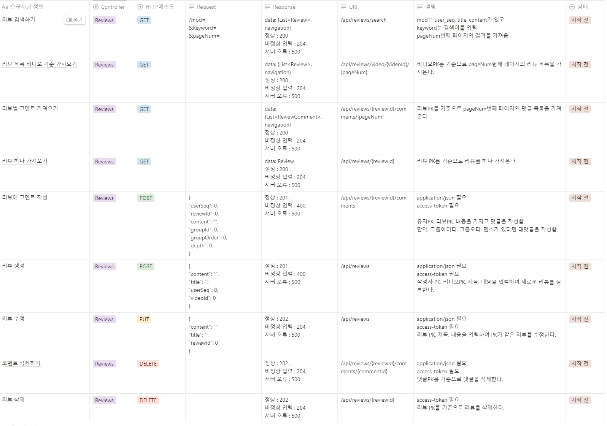
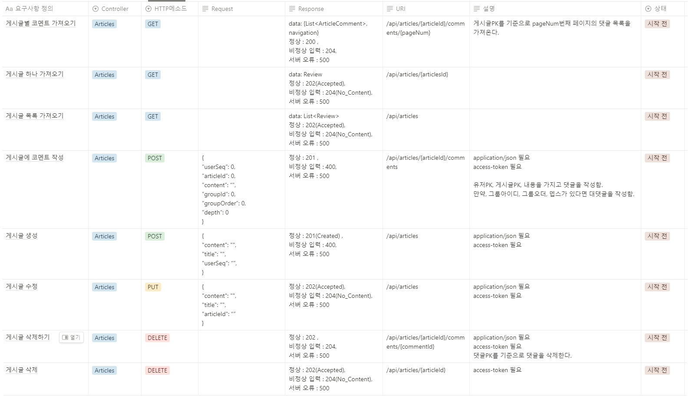
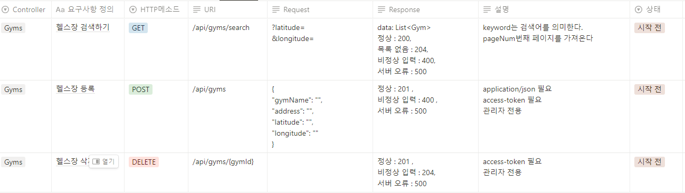

# BodyFItPjt

## 구성원

- 이연학
- 김명준

## 프로젝트 설명

- 시연영상 : https://ramen-buang.notion.site/1-4c8c01e1896c4bf6b1ff8eec890d6dd4

- 목적에 맞는 운동 영상을 제공하고 해당 영상에 맞는 커뮤니티 기능을 제공하는 페이지 입니다.
- 각각의 영상에 리뷰를 작성 할 수 있고 해당 동영상에 좋아요 / 싫어요 기능을 지원합니다.
- 뿐만아니라 모든 유저에 대해서 팔로우 / 언팔로우 기능을 제공 합니다.
- 게시판 / 리뷰에 댓글 기능을 지원합니다. 댓글은 계속해서 꼬리잇기로 내려가는 무한 대댓글의 기능을 지원합니다.
- 마이페이지에서 내가 팔로우 하는 대상과 나를 팔로우 하는 대상 / 작성한 리뷰등을 간편하게 조회 할 수 있습니다.

## 사용된 기술 스택

- Node 18.12.1 LTS
  - NPM 8.19.2
  - Vue 2.6.14
    - Vue CLI 5.0.8
    - vue-router 3.5.1
    - vuex 3.6.2
  - axios 1.1.3
  - bootstrap 5.2.2
- Java 11.0.17 : Zulu 11.60.19
  - Gradle
  - SpringBoot 2.7.5
    - spring-boot-starter-web
    - mybatis-spring-boot-starter
    - lombok
    - boot:spring-boot-devtools
    - mysql-connector-j
    - spring-boot-starter-test
    - spring-boot-starter-security
  - springfox-boot-starter 3.0.0 (swagger)
  - jjwt 0.9.1
    - jaxb-api 2.3.1
    - jaxb-core 2.3.0.1
    - jaxb-impl 2.3.1
- MySQL 8.0.30

#### IDE

- IntelliJ
- Visual Studio Code

## 기획 단계

### 프론트 목업

### 데이터베이스 다이어그램

### API 명세서

#### videos

#### users

#### reviews

#### articles

#### gyms

