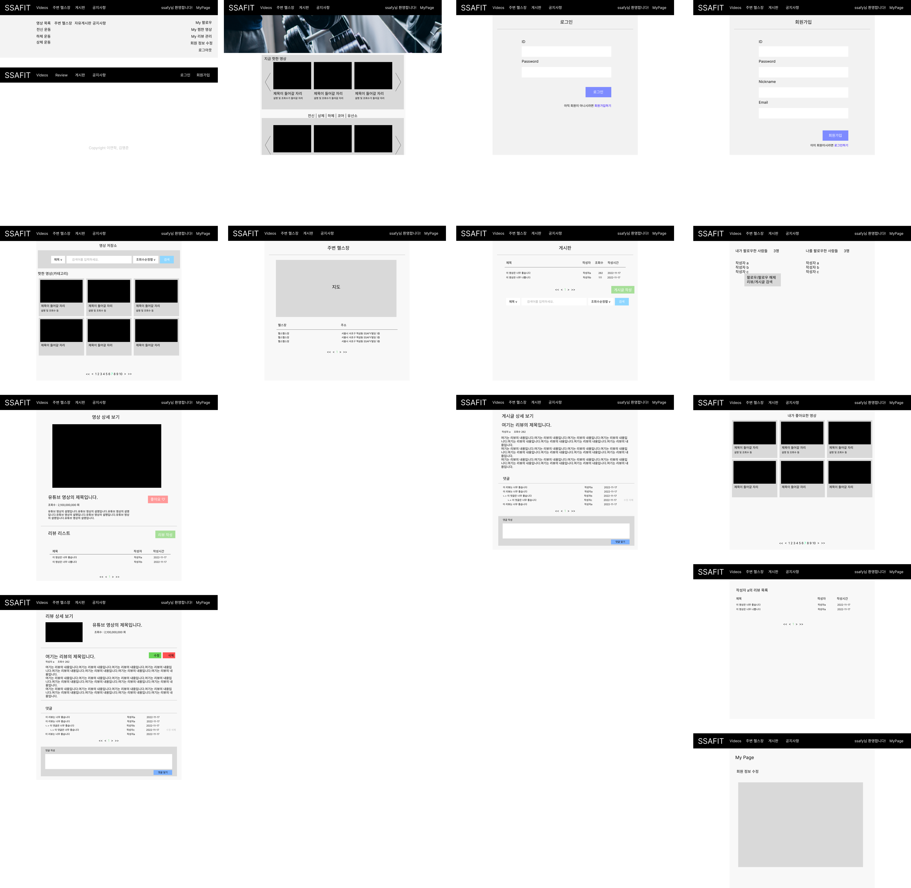
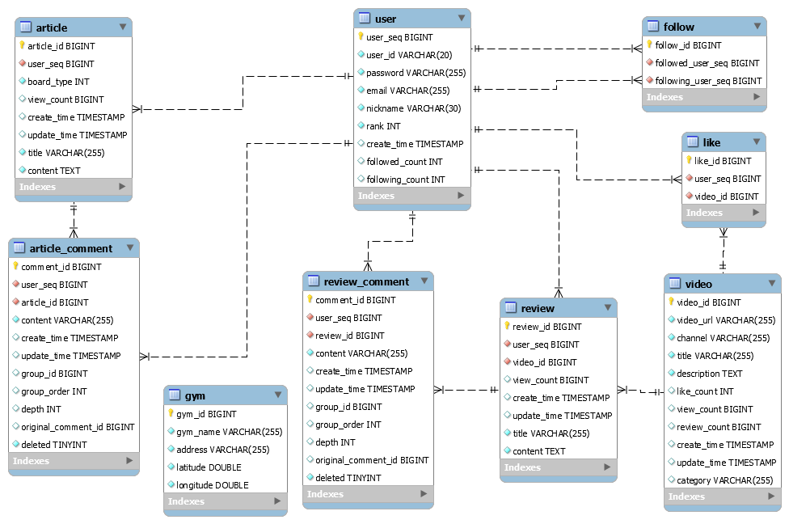
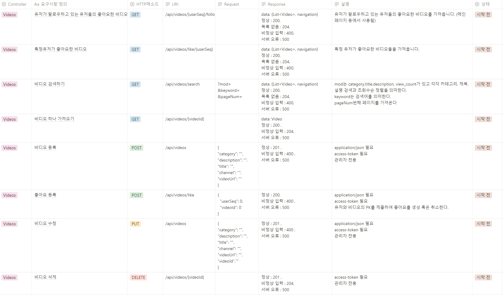
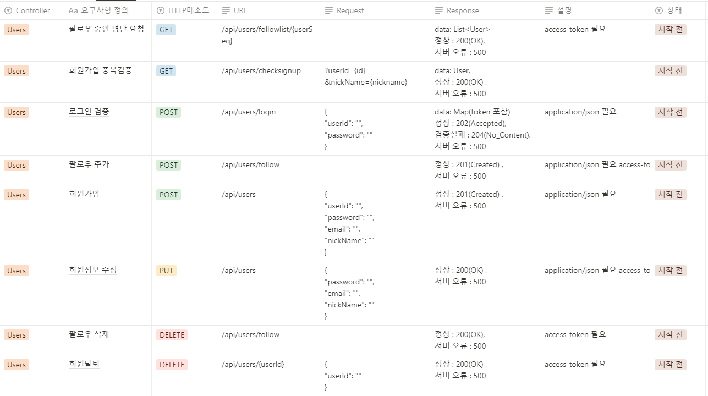
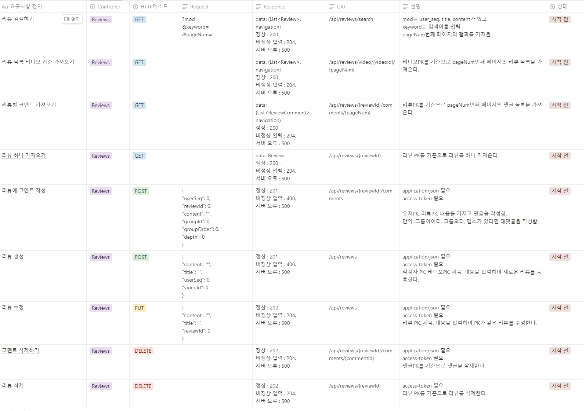
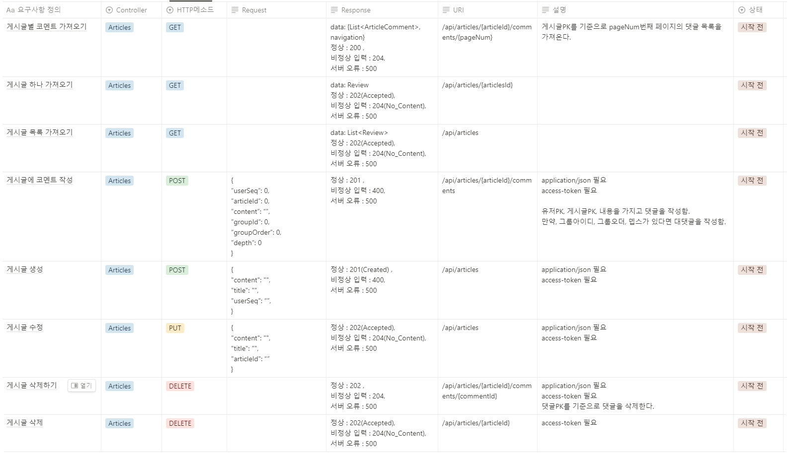
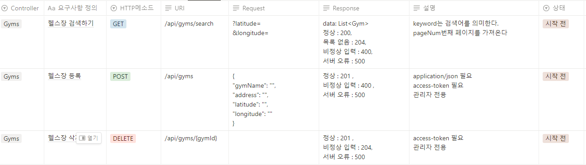

# BodyFItPjt

## 구성원
- 이연학
- 김명준

## 구성원
- 자세한 프로젝트 내용을 .pptx 파일을 참고해 주세요!

## 사용된 기술 스택
- Node   18.12.1 LTS
    - NPM   8.19.2
    - Vue   2.6.14
        - Vue CLI   5.0.8
        - vue-router   3.5.1
        - vuex   3.6.2
    - axios   1.1.3
    - bootstrap   5.2.2
- Java 11.0.17 : Zulu 11.60.19
    - Gradle
    - SpringBoot 2.7.5
        - spring-boot-starter-web
        - mybatis-spring-boot-starter
        - lombok
        - boot:spring-boot-devtools
        - mysql-connector-j
        - spring-boot-starter-test
        - spring-boot-starter-security
    - springfox-boot-starter 3.0.0 (swagger)
    - jjwt 0.9.1
        - jaxb-api   2.3.1
        - jaxb-core   2.3.0.1
        - jaxb-impl    2.3.1
- MySQL 8.0.30
#### IDE

- IntelliJ
- Visual Studio Code

## 기획 단계

### 프론트 목업

### 데이터베이스 다이어그램

### API 명세서

#### videos

#### users

#### reviews

#### articles

#### gyms

